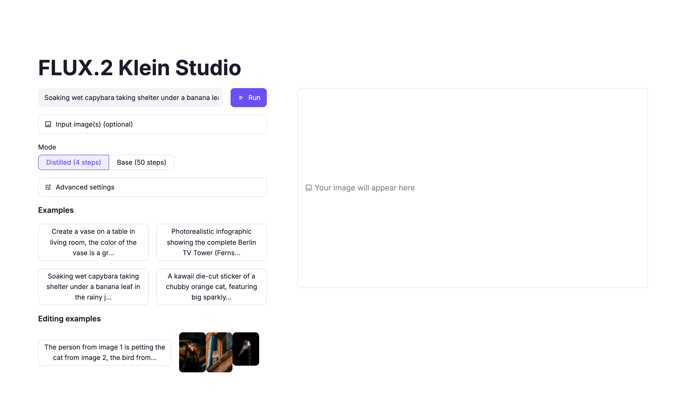
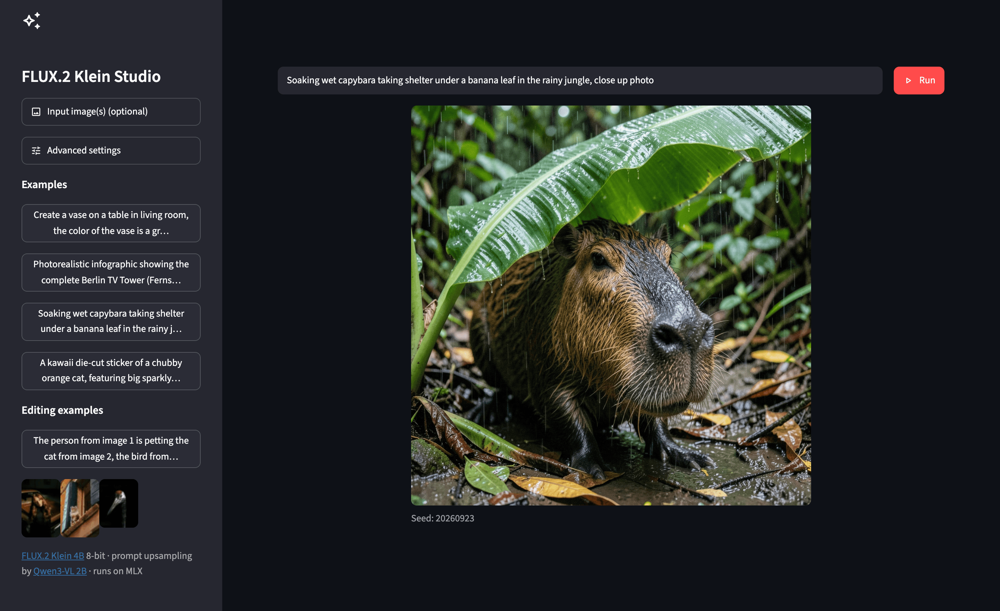

# FLUX.2 Klein Studio

[](https://github.com/darylalim/flux2-klein-studio/actions/workflows/ci.yml)
[](https://github.com/darylalim/flux2-klein-studio/releases)
[](LICENSE)

Streamlit application for generating and editing images using Black Forest Labs [FLUX.2 Klein](https://huggingface.co/black-forest-labs/FLUX.2-klein-4B) on Apple Silicon with MLX.

<p align="center">
  
  
</p>
<p align="center"><sub>Native light and dark themes (left / right)</sub></p>

## Features

- Unified generation and editing — text-to-image by default; uploading one or more images switches to editing automatically
- Two speed/quality modes: Distilled (4 steps) and Base (50 steps)
- Native Apple Silicon performance via MLX — inference runs on MLX, not PyTorch
- Two-column studio layout: controls on the left, generated image on the right
- Enter to run — the prompt row is a borderless form, so pressing Enter submits the run
- Multi-image upload for editing and compositing workflows
- Auto-dimension: width/height sliders adjust to match the first input image's aspect ratio
- Optional vision-aware prompt upsampling via SmolVLM-500M-Instruct — a toggle in Advanced settings; the VLM can see uploaded images when enhancing edit prompts (loaded on first use)
- Clickable examples — text-to-image prompts plus an editing example with bundled input images (loading one replaces any manual upload)
- Per-step progress bar shown inside the output frame during inference, with labeled spinners for first-time model loads and prompt enhancement
- Configurable seed, dimensions, guidance scale, and inference steps in Advanced settings
- Native light/dark theme via `.streamlit/config.toml` (no custom CSS), with WCAG AA-compliant link contrast in both modes
- Graceful failure handling — empty runs are blocked; unreadable uploads and generation errors surface inline instead of crashing the app

## Requirements

- Apple Silicon Mac (M1+)
- Python 3.12+

## Setup

1. Install [uv](https://docs.astral.sh/uv/getting-started/installation/)
2. Install dependencies: `uv sync`
3. Run the application: `uv run streamlit run streamlit_app.py`

Models download automatically on first use and are cached locally for reuse: budget roughly 8–10GB per FLUX.2 Klein variant — Distilled and Base are separate downloads, so trying both pulls both — plus ~1GB for SmolVLM.

## Usage

The studio opens with controls on the left and the output on the right.

**Text-to-image** — type a prompt, then press **Enter** or click **Run**. The generated image appears on the right, labeled with the seed used.

**Editing and compositing** — expand **Input image(s)** and upload one or more files (JPG, PNG, or WebP). The app switches to editing automatically — there's no generate/edit switch to flip. The width and height sliders snap to the first image's aspect ratio; describe the change and Run. With multiple images you can composite across them — the bundled editing example turns these three inputs into a single scene:

<p align="center">
  
  
  
</p>

**Mode** — choose *Distilled (4 steps)* for fast drafts or *Base (50 steps)* for higher quality.

**Advanced settings** (collapsed by default):

- **Prompt upsampling** — a vision-language model (SmolVLM-500M) rewrites your prompt into a more descriptive one; when editing, it can see your uploaded images. Off by default.
- **Seed** — *Randomize* is **on** by default, so each Run varies. Turn it off and set a seed for reproducible results.
- **Width / Height / Number of inference steps / Guidance scale** — fine-tune output size and sampling.

**Examples** — click a prompt example to fill the box, or an editing example to load its prompt together with its bundled input images.

## Development

Lint, format, type-check, and run the unit tests (no GPU or model download required):

```bash
uv run ruff check .   # Lint
uv run ruff format .  # Format
uv run ty check .     # Type check
uv run pytest         # Unit tests
```

### Continuous integration

[GitHub Actions](.github/workflows/ci.yml) runs the same four checks on every push to `main` and every pull request, on a single `macos-latest` (Apple Silicon) runner — `mlx` only ships a CUDA build for Linux, so the suite can't import on a GPU-less Linux runner, and macOS is the app's target platform anyway. No model weights are downloaded (the tests mock the model loaders), so CI stays fast and needs no Hugging Face token. A secret-leak guard (`tests/test_secrets.py`) also fails the build if any tracked file contains a recognizable secret — an HF or GitHub token, a private key, or an AWS access key — or if `.env`/`secrets.toml` is ever committed. A license-consistency check (`tests/test_license.py`) likewise keeps the `LICENSE` file, the `pyproject.toml` metadata, and the README License section in agreement, so relicensing one without the others fails CI. A README-asset guard (`tests/test_readme.py`) fails the build if the README embeds a local image — a `docs/` screenshot or an `examples/` input — that is missing from the repo or not git-tracked (a broken image on GitHub). `.python-version` pins the interpreter to 3.12 so local `uv` and CI resolve the same runtime.

### Releases

Pushing a `vX.Y.Z` tag triggers [a release workflow](.github/workflows/release.yml) that first checks the tag matches the version declared in `pyproject.toml` — a mismatch fails the build instead of publishing a mislabeled release — and then publishes a [GitHub release](https://github.com/darylalim/flux2-klein-studio/releases) with auto-generated notes. `tests/test_release.py` locks the workflow's contract, the same way `tests/test_ci.py` locks CI. A cross-workflow guard (`tests/test_workflows.py`) additionally fails the build if any workflow's `run:` script interpolates a `${{ }}` expression directly — the GitHub Actions command-injection vector.

### Claude Code hooks

This repo ships opt-in [Claude Code](https://claude.com/claude-code) hooks (in `.claude/`) that run the checks above automatically as you edit: format + lint-fix (`ruff`) and type-check (`ty`) on each Python change, the test suite (`pytest`) once at the end of a turn that touched app/test/theme code, and a guard that blocks `Edit`/`Write` to `.env` and `uv.lock` (it does not intercept `Bash` writes, and fails closed if `jq` is missing). They require [`jq`](https://jqlang.github.io/jq/) and activate on session start (run `/hooks` to review). `tests/test_hooks.py` covers their behavior; `.claude/settings.local.json` (personal overrides) is gitignored.

## License

This project is released under the [MIT License](LICENSE).

It builds on components with their own licenses, all permissive:

- **FLUX.2 Klein 4B** (distilled and base) and **SmolVLM-500M-Instruct** — [Apache-2.0](https://huggingface.co/black-forest-labs/FLUX.2-klein-4B) (open weights, commercial use permitted). The 9B FLUX.2 Klein variants carry a non-commercial license and are **not** used here.
- **mflux** and **mlx-vlm** — MIT
- **Streamlit** — Apache-2.0

Model weights are downloaded at runtime from Hugging Face rather than bundled in this repository.
